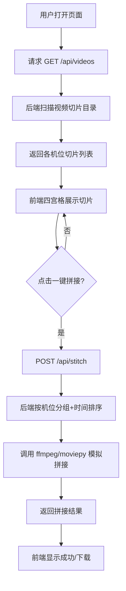

## 1. 产品概述

行车记录仪四路视频管理与拼接系统，用于管理车载前、后、左、右四个高清行车记录仪产生的视频切片，并提供可视化界面进行视频预览与一键全机位拼接。

- 目标用户：车队管理员、事故处理人员、行车数据分析师
- 核心价值：将碎片化的多路行车视频统一管理和快速拼接，提升事故回溯与视频审查效率

## 2. 核心功能

### 2.1 功能模块

1. **视频切片总览页**：四宫格展示前/后/左/右四个机位的视频切片列表，按时间排序
2. **一键全机位拼接**：点击按钮将四个机位的视频切片按时间顺序拼接成完整视频

### 2.2 页面详情

| 页面名称 | 模块名称 | 功能描述 |
|----------|----------|----------|
| 视频管理页 | 四宫格机位面板 | 展示前/后/左/右四个机位，每个机位显示最近5分钟的视频切片列表（文件名、时间），按时间排序 |
| 视频管理页 | 一键拼接按钮 | 点击后调用后端拼接接口，将四个机位视频按时间顺序拼接，显示拼接进度和结果 |
| 视频管理页 | 拼接状态提示 | 显示拼接任务的进行中/成功/失败状态，提供结果下载 |

## 3. 核心流程

用户打开页面 → 前端请求 GET /api/videos 获取四个机位的视频切片列表 → 页面以四宫格展示各机位切片 → 用户点击"一键全机位拼接" → 前端调用 POST /api/stitch → 后端按机位分组、按时间排序拼接 → 返回拼接结果 → 前端展示成功状态

## 4. 用户界面设计

### 4.1 设计风格

- 主色调：深色科技风（#0A0E17 深蓝黑底 + #00D4AA 青绿强调色），营造车载监控系统的专业感
- 辅助色：#1A1F2E 卡片背景，#2D3548 边框色，#E8ECF1 文字色
- 按钮风格：圆角矩形，拼接按钮使用渐变（#00D4AA → #00B4D8）带发光效果
- 字体：JetBrains Mono（代码/数据风格）+ Noto Sans SC（中文正文）
- 布局风格：卡片式四宫格，顶部标题栏，底部操作栏
- 图标风格：线性图标，2px 描边

### 4.2 页面设计概览

| 页面名称 | 模块名称 | UI 元素 |
|----------|----------|---------|
| 视频管理页 | 顶部标题栏 | 系统名称 + 状态指示灯（绿色闪烁表示系统运行中） |
| 视频管理页 | 四宫格面板 | 2x2 网格，每个格子含机位标签（前/后/左/右）、摄像头图标、切片列表（滚动）、切片数量统计 |
| 视频管理页 | 切片列表项 | 文件名（monospace字体）+ 时间标签，hover 时高亮 |
| 视频管理页 | 一键拼接按钮 | 底部居中大按钮，渐变色+发光，点击后变为进度条 |
| 视频管理页 | 状态提示 | Toast 通知，拼接成功/失败反馈 |

### 4.3 响应式设计

- 桌面优先，4列布局（大屏可2x2网格）
- 平板端：2x2网格保持
- 移动端：单列堆叠，每个机位折叠卡片
