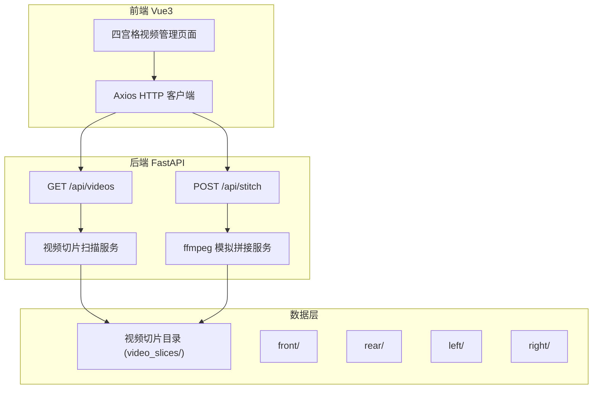

## 1. 架构设计



## 2. 技术说明

- 前端：Vue3 + Vite + TailwindCSS
- 后端：Python FastAPI + uvicorn
- 视频处理：模拟 ffmpeg 命令（使用 subprocess 调用 ffmpeg，若未安装则用 moviepy 作为降级方案）
- 数据存储：文件系统（无数据库），视频切片以目录结构组织
- 前后端通信：REST API + JSON

## 3. 路由定义

| 路由 | 用途 |
|------|------|
| / | 视频管理主页面（四宫格总览） |

## 4. API 定义

### 4.1 GET /api/videos

获取所有机位的视频切片列表。

**响应 Schema：**

```typescript
interface VideoSlice {
  filename: string
  camera: "front" | "rear" | "left" | "right"
  timestamp: string
  size_kb: number
}

interface VideosResponse {
  slices: VideoSlice[]
  summary: {
    front: number
    rear: number
    left: number
    right: number
  }
}
```

### 4.2 POST /api/stitch

一键全机位拼接，将四个机位视频按时间顺序拼接。

**请求 Schema：**

```typescript
interface StitchRequest {
  cameras: ("front" | "rear" | "left" | "right")[]
}
```

**响应 Schema：**

```typescript
interface StitchResponse {
  task_id: string
  status: "processing" | "completed" | "failed"
  output_file?: string
  message: string
}
```

### 4.3 GET /api/stitch/{task_id}

查询拼接任务状态。

**响应 Schema：**

```typescript
interface StitchStatusResponse {
  task_id: string
  status: "processing" | "completed" | "failed"
  output_file?: string
  message: string
  progress: number
}
```

## 5. 服务器架构


- Router：处理 HTTP 请求/响应，参数校验
- Service：业务逻辑（视频扫描、拼接编排、任务管理）
- Repository：文件系统操作（读取目录、写入拼接结果）

## 6. 数据模型

### 6.1 视频切片目录结构

```
video_slices/
├── front/
│   ├── front_20260618_143001.mp4
│   ├── front_20260618_143031.mp4
│   ├── front_20260618_143101.mp4
│   └── ...
├── rear/
│   ├── rear_20260618_143001.mp4
│   └── ...
├── left/
│   ├── left_20260618_143001.mp4
│   └── ...
└── right/
    ├── right_20260618_143001.mp4
    └── ...
```

### 6.2 文件命名规范

格式：`{camera}_{YYYYMMDD}_{HHMMSS}.mp4`
- camera：front / rear / left / right
- 每个切片约30秒，5分钟内产生约10个切片/机位

### 6.3 拼接输出

- 输出目录：`output/`
- 输出文件名：`stitched_{camera}_{YYYYMMDD_HHMMSS}.mp4`
- 每个机位单独拼接输出一个文件
